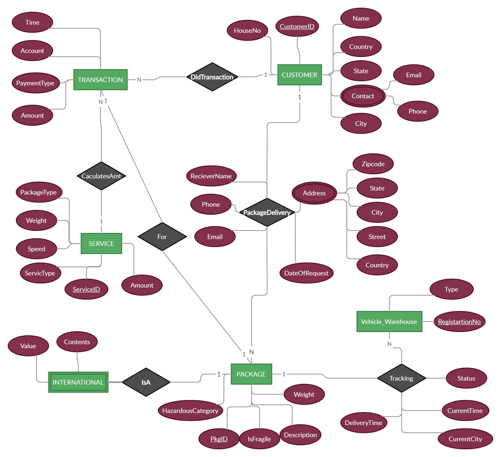
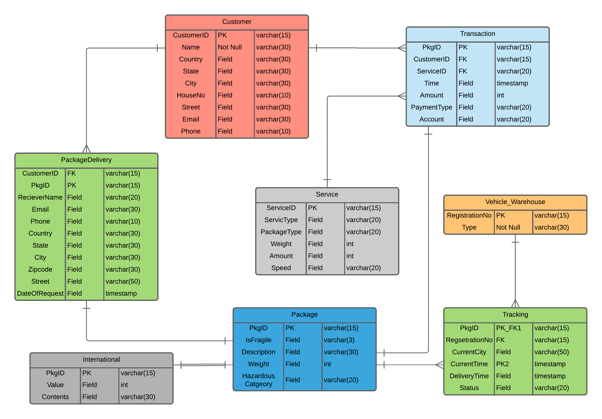

# Package-Delivery-DBMS
This is a Dtabase application that can be useful for a package delivery company (similar to FedEx, UPS, DHL, the USPS, etc.)

# Diagrams
<b>ER(Entity Relationship) - Diagram</b>

  

<b>Relational Model</b>

  

Links for Video Presentation, PDF and CSV Files -> https://drive.google.com/drive/folders/1hbA60C8pDK4Yrs8OClDGCUKH-RwI6ONf?usp=sharing
